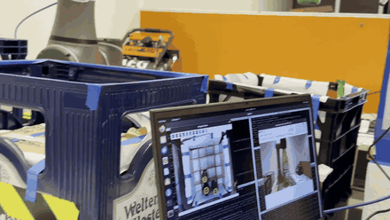
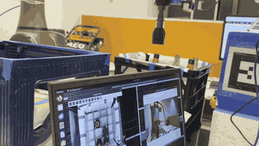
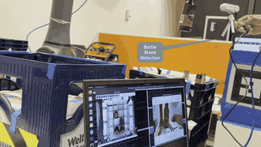
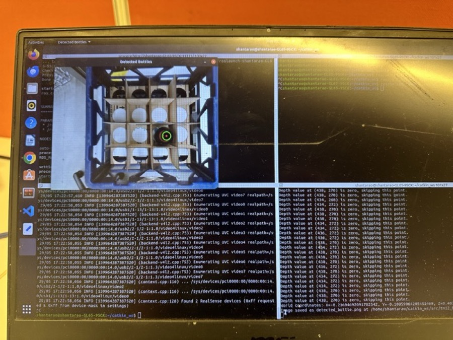
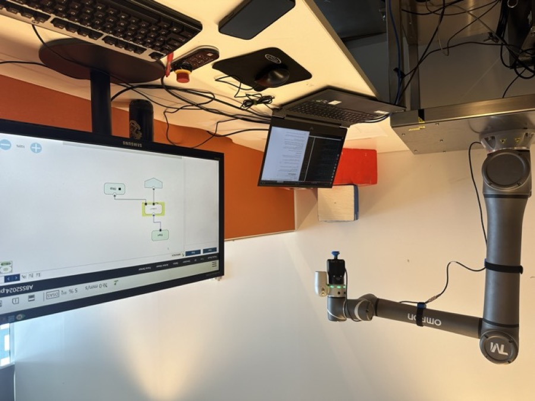
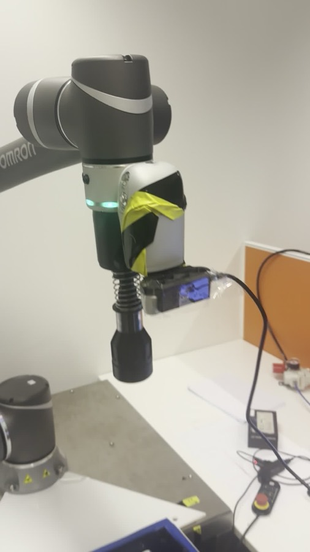
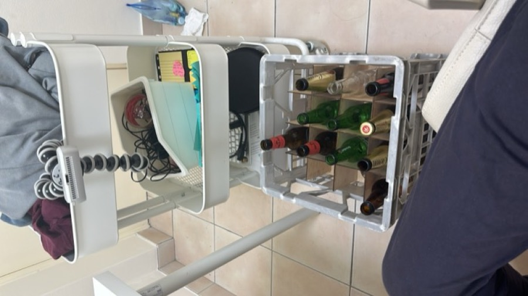
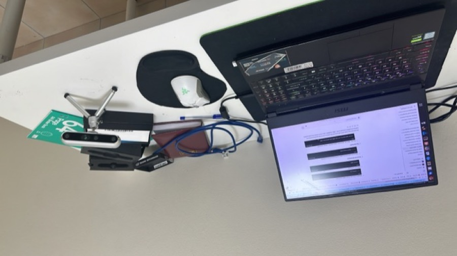
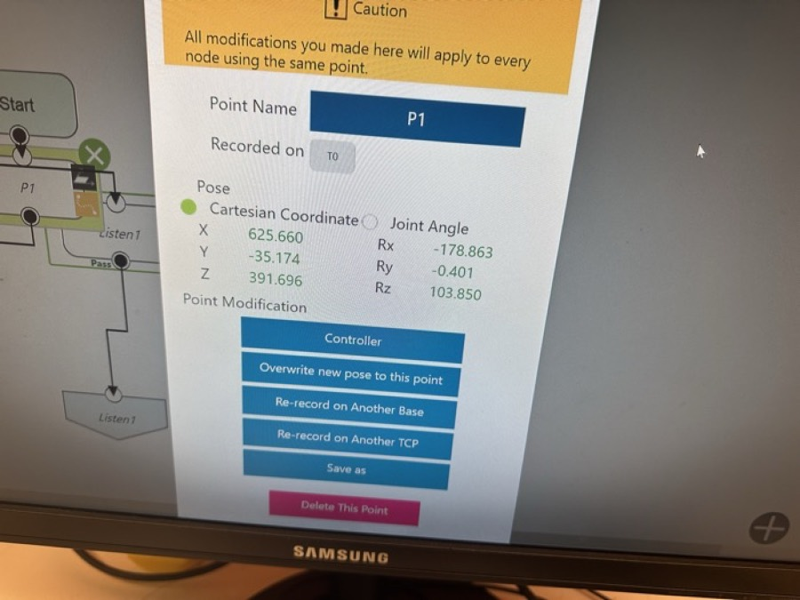

# Automated Bottle Recognition and Sorting System (ABRSS)

An Omron TM12 cobot that empties a crate of returned glass bottles, works out
what brand each one is, and puts it in the right crate. Two RealSense depth
cameras do the seeing: one looks down into the incoming crate to find bottles,
the other reads the label once a bottle is held up to it.

Built by Team 01 for **41069 Robotics Studio 2** at UTS in 2024.
ROS 1 Noetic, Ubuntu 20.04.

[](https://github.com/SaurabhKhimesra/bottle_sorting/actions/workflows/ci.yml)



*Full two-minute run: [`docs/media/full_run.mp4`](docs/media/full_run.mp4)*

> This repository is a fork of [dbamin/Bottle_Sorting](https://github.com/dbamin/Bottle_Sorting),
> the repo Team 01 worked in during the unit. Darshil owned it and pushed it,
> so the whole original history sits under his account and the contributor
> graph here says nothing about who wrote which subsystem — [Team](#team)
> does. I've kept the fork rather than re-uploading the code under my own
> name; my own commits are the repair work described at the bottom.

---

## What it actually does

The cycle runs once per bottle:

1. The arm moves to a fixed pose where the whole crate is in `cam_1`'s view.
2. A Hough circle transform finds the bottle mouths looking straight down.
   Each detected circle is mapped to one of 16 crate slots by which pixel band
   its centre falls in. The lowest-numbered occupied slot is the one we go for.
3. The arm moves to that slot and the pneumatic gripper closes on the bottle.
4. The bottle comes up in front of `cam_2`, and YOLOv5 classifies the label
   into one of three brands.
5. The arm carries it to that brand's crate and drops it in. A per-brand
   counter on disk rotates between three drop positions so bottles don't
   stack on each other — it's a round-robin, not free-space detection.

Running alongside all of that, a MediaPipe pose detector watches the workspace.
If a person appears in frame the arm stops. If the depth image shows anything
closer than a metre, that volume is pushed into the MoveIt planning scene as a
collision box and the path is replanned around it.

Three stages of that cycle, from the June 2024 demonstration:

| Gripping | Reading the label |
|---|---|
|  |  |
| The arm has the crate slot and drops onto the bottle. | The bottle is presented to `cam_2` and YOLOv5 reads the label. |



*`bottle_position.py` running: detected bottle mouths on the left, the node's
log on the right. This is the view `show_debug_window` gives you.*

## How the nodes fit together

There is no central state machine. Each node blocks until it hears the message
it's waiting for, does one thing, and announces it — so the sequence is the
topic graph, not a scheduler. It made the thing easy to debug one stage at a
time on real hardware, which mattered more than elegance when we had the lab
for two hours at a stretch.

```
node_1 ──"Robot has reached the position to detect the bottle"──► robot_feedback
                                                                       │
bottle_position.py ◄───────────────────────────────────────────────────┘
   captures /cam_1 RGB + depth, Hough circles, writes min_bottle_position.txt
   └──"sending co-ordinates of the detected bottle to the gripper"──► gripper_feedback
                                                                       │
node_3 ◄───────────────────────────────────────────────────────────────┘
   reads the slot, moves there
   └──"Robot is ready to grip"──► robot_feedback
                                       │
gripper_ON ◄───────────────────────────┘
   └──"The bottle is gripped"──► grip_status
                                       │
node_6 ◄───────────────────────────────┘
   lifts and presents the label to cam_2
   └──"Ready to detect the bottle."──► bottle_detection_ready
                                       │
brand_detection.py ◄───────────────────┘
   captures /cam_2, runs YOLOv5 detect.py, publishes the class id
   └──"Brand of the bottle has been detected"──► detection_message_topic
                                       │
node_7 ◄───────────────────────────────┘
   reads the label file, places into that brand's crate

human_detection_node.py   (independent, runs the whole time)
   /cam_1 colour ──► MediaPipe pose ──► stop the arm
   RealSense depth ──► obstacle within 1 m ──► MoveIt collision box + replan
```

`/feedback_states` is the TM driver's joint feedback; the motion nodes poll it
and consider a pose reached when every joint is within 1–2% of target.

## Hardware

| | |
|---|---|
| Arm | Omron TM12 (Techman), driven through [`tmr_ros1`](https://github.com/TechmanRobotInc/tmr_ros1) 1.10.3 |
| Gripper | Pneumatic, switched over the TM control box's digital outputs |
| `cam_1` | Intel RealSense, serial `317222070960` — overhead, watches the crate |
| `cam_2` | Intel RealSense, serial `241122302615` — faces the gripper, reads labels |

The serials are the two units that were on our bench. Run
`rs-enumerate-devices` and pass `cam_1_serial` / `cam_2_serial` to
`multi_camera.launch` if you're on different hardware.

## Layout

```
src/
├── tm12_bottle_sorting/        the package we wrote
│   ├── launch/
│   │   ├── bottle_sorting_system.launch   the whole cycle
│   │   └── multi_camera.launch            both RealSenses
│   ├── scripts/                Python nodes — vision and safety
│   └── src/                    C++ nodes — arm motion and gripper IO
├── realsense-ros/              vendored, not a submodule (see below)
├── tmr_ros1/                   submodule — Techman's TM driver
└── yolov5/                     submodule — Ultralytics, holds our trained weights

docs/media/                     demo footage and photos of the rig
scripts/check_workspace.py      static checks, run in CI
```

`realsense-ros` is a copy rather than a submodule because two of its launch
files were edited in place for our two-camera rig —
`rs_multiple_devices.launch` and `rs_d435_camera_with_model.launch`. Intel's
`LICENSE` and `NOTICE` are kept with it.

## The rig

| | |
|---|---|
|  |  |
| The TM12 with `cam_2` on the flange and TMflow on the monitor behind. | The end effector — depth camera and pneumatic gripper on the same mount. |
|  |  |
| The crate. The dividers are what the 4×4 slot mapping is counting. | Intrinsic calibration off a printed checkerboard, before either camera went on the arm. |



*Teaching a pose in TMflow. The joint targets hardcoded in `node_1.cpp`,
`node_3.cpp` and `node_7.cpp` were all read off this screen.*

## Build

```bash
git clone --recurse-submodules https://github.com/SaurabhKhimesra/bottle_sorting.git
cd bottle_sorting
rosdep install --from-paths src --ignore-src -r -y
catkin_make
source devel/setup.bash
```

YOLOv5 needs its own Python deps, and the safety node needs MediaPipe:

```bash
pip install -r src/yolov5/requirements.txt
pip install mediapipe pyrealsense2
```

The trained weights are expected at
`src/yolov5/runs/train/exp/weights/best.pt`. Point `brand_detection.py` at a
different file with the `weights` parameter.

## Run

Cameras and the TM driver first, then the cycle:

```bash
roslaunch tm12_bottle_sorting multi_camera.launch
roslaunch tm_driver tm12_driver.launch robot_ip:=<robot ip>
roslaunch tm12_bottle_sorting bottle_sorting_system.launch
```

Captured frames, the chosen crate slot and the per-brand counters are written
to `runtime/` inside the package. Point them somewhere else with
`runtime_dir:=/path/to/wherever`.

To watch the detection while it runs, start `bottle_position.py` with
`_show_debug_window:=true` — it's off by default because `waitKey` blocks the
callback and there's no display under `roslaunch`.

## Known limitations

Worth being straight about what this is: a two-hours-a-week prototype that
worked on the bench, not a product.

- **The crate mapping is pixel bands, not geometry.** `get_bottle_position()`
  splits the frame into four bands of x and four of y and calls that a 4×4
  crate. Move the camera and every slot number is wrong. Doing it properly
  means detecting the crate corners and homographing to crate coordinates.
- **The Hough parameters are tuned to one crate under one set of lights** —
  `minRadius=16, maxRadius=22` is the bottle mouth in pixels at our specific
  camera height. It does not survive a change of bottle or a change of bench.
- **One bottle per run of `brand_detection.py`.** It calls `rospy.signal_shutdown`
  in its `finally` block, so the node exits after a single classification. It
  also shells out to `detect.py` with `os.system`, which reloads the model
  every time — a couple of seconds a bottle that a persistent `torch.hub`
  load would remove.
- **`node_8` never fires.** It waits on `robot_release_feedback` and nothing
  publishes that topic, so the automatic release was never wired up; we ran
  `gripper_OFF` by hand at the end of a cycle. A remap in the launch file
  would close it, but I'd rather leave a known gap documented than guess at
  when a gripper full of glass should open.
- **Crate 1's three sub-positions are the same pose** repeated three times in
  `node_7.cpp` — placeholders we never came back and measured.
- **The gripper's on and off nodes disagree about pins.** `gripper_ON` drives
  digital outputs 0 and 1 high; `gripper_OFF` pulls 1 and 2 low. Pin 0 is
  never cleared and pin 2 is never set. It held the bottles on our rig, so it
  went unnoticed until I read the two files side by side.
- **`node_7` picks the newest YOLOv5 output directory by mtime**, which is
  fine for one run at a time and breaks the moment anything else writes there.
- **Camera intrinsics and the camera-to-gripper transform are hardcoded**
  (`fx=606.53, fy=605.46, cx=326.57, cy=244.11`; the camera sits 270° about X,
  90° about Y, 180° about Z from the end effector). They came off one
  calibration of one camera. `lookup_transform.py` does the same job through
  TF and is the direction the rest should have gone.
- **No automated tests.** Everything was verified by running it on the arm.
  `scripts/check_workspace.py` is the closest thing — it's static checks over
  the launch files, shebangs and paths, written after the fact so the specific
  breakages listed at the bottom of this file can't come back. It is not a
  substitute for testing the motion.

## Licence

MIT, copyright the four of us jointly — see [LICENSE](LICENSE).

The third-party code in `src/` keeps its own terms, listed in
[THIRD_PARTY.md](THIRD_PARTY.md). The one to be aware of is YOLOv5, which is
AGPL-3.0 — fine for coursework, something to deal with before reusing the
brand classifier in a product.

## Team

Four of us, splitting the system by subsystem:

| | |
|---|---|
| **Saurabh Khimesra** | Collision avoidance and safety — MediaPipe human detection, depth-based obstacle detection, MoveIt planning-scene replanning (`human_detection_node.py`). Perception support — the Hough circle detector, crate-slot mapping and camera-to-robot transform (`bottle_position.py`, `lookup_transform.py`, the RGB-D capture nodes). System integration — the single launch file that ties the nodes together. |
| **Darshil Amin** | Safety system and gripper integration — the pneumatic gripper control over the TM digital IO (`gripper_ON.cpp`, `gripper_OFF.cpp`) |
| **Rupesh Hirani** | Perception — YOLOv5 brand classification and the trained model (`brand_detection.py`) |
| **Sonu Kanwal** | Trajectory planning — the arm's pick and place poses and the TM driver motion nodes |

Supervised by Marc Carmichael, Sheila Sutjipto and Felix Kong.

## About the commits on this fork

The code is as it was demonstrated in June 2024. What I've committed since is
repair, not new features — the repo had stopped being clonable:

- The system launch file started a node under a filename that didn't exist, so
  `roslaunch` aborted the whole cycle.
- The safety node had three separate faults that meant it had never run —
  including `if _name_ == '_main_'` with single underscores, which quietly
  stops `main()` being called.
- Every node held an absolute path into whichever laptop it was written on
  (`/home/rh/...`, `/home/shantarao/...`), so nothing ran anywhere else. Those
  now resolve through `ros::package::getPath` / `rospkg` with parameters to
  override them.
- `.gitmodules` was missing, so `tmr_ros1` and `yolov5` cloned as empty
  directories.
- The README was the unedited chat transcript it had been generated from,
  documenting a file layout the project never had.

Each is a separate commit if you want to see the diffs.
